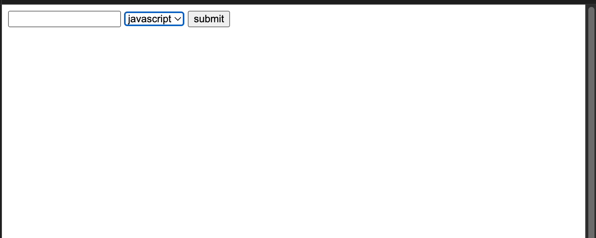
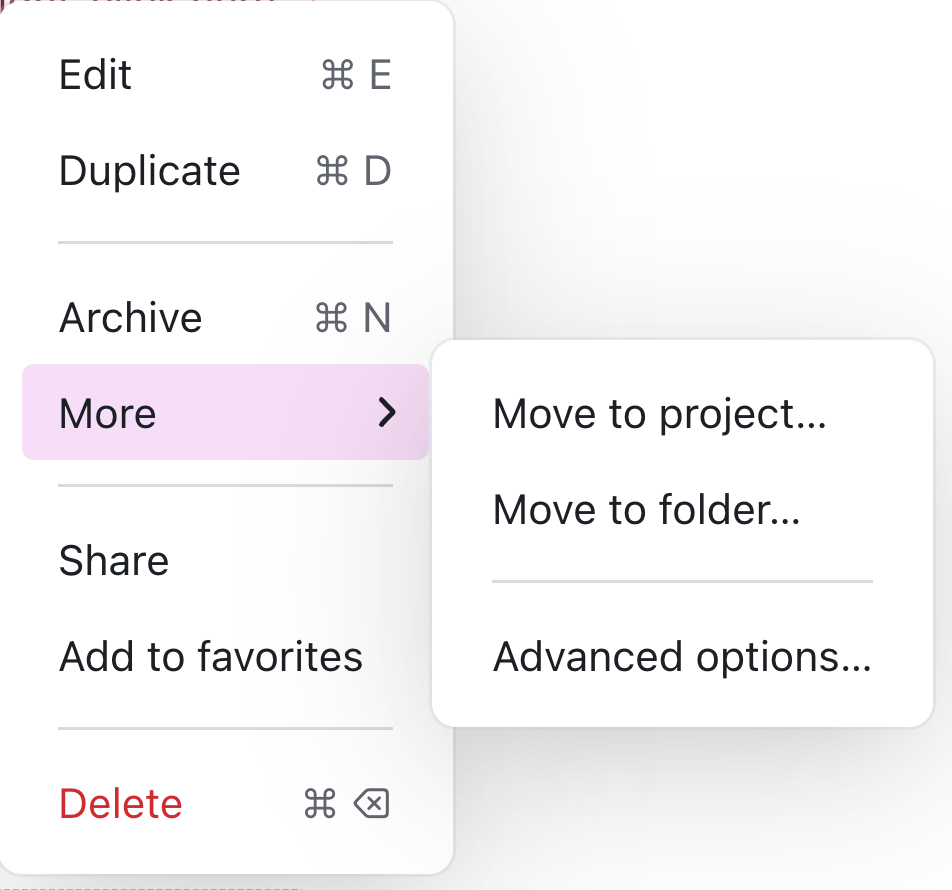
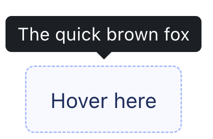
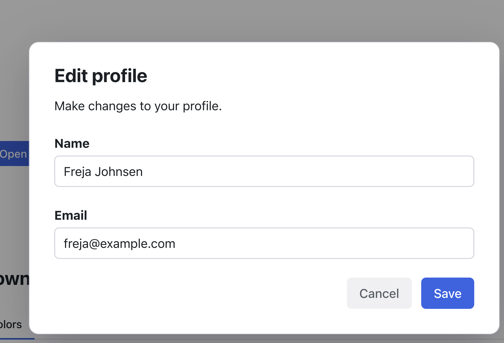
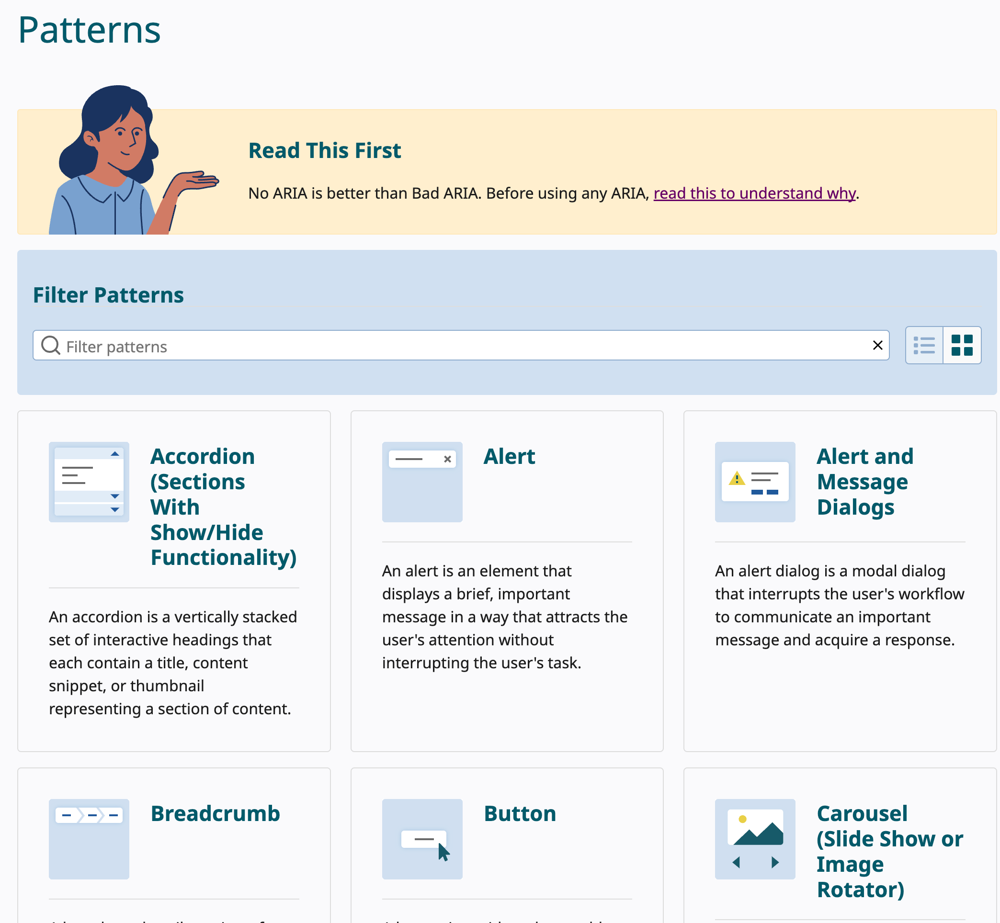
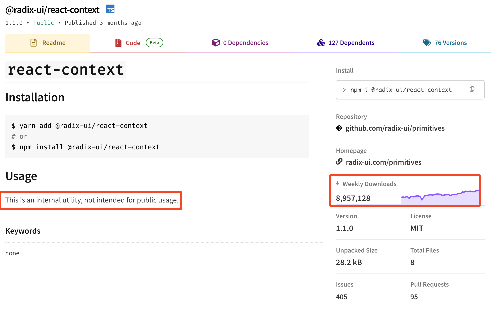
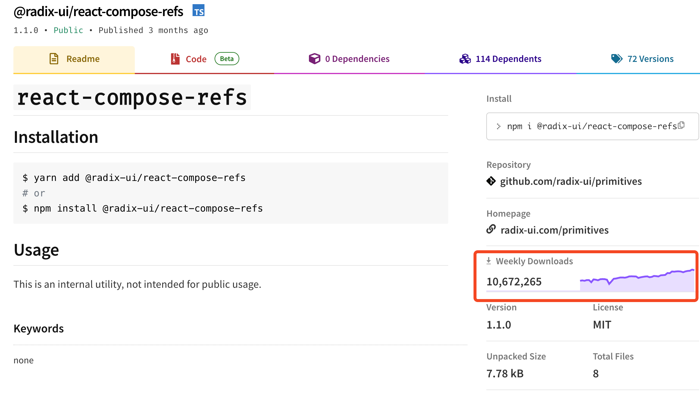
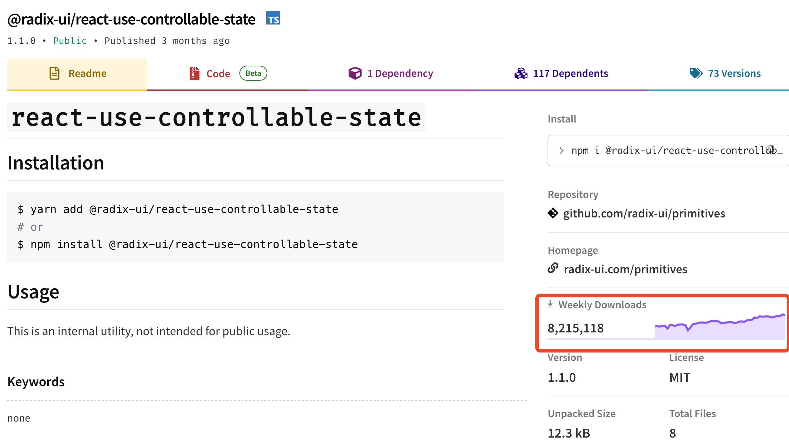
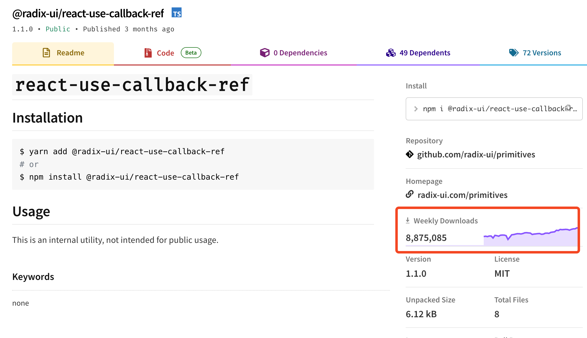

___RADIX UI___


---

<div class="font-mid">

Radix는 UI 라이브러리

<div class="fragment">

- 복잡한 UI를 <strong>HTML의 기본 엘리먼트처럼 쉽게 사용</strong>할 수 있다
</div>

<div class="fragment">

```html

<form action="/register" method="post">
    <input name="email" />

    <select name="language">
        <option value="javascript">javascript</option>
        <option value="python">python</option>
        <option value="java">java</option>
    </select>

    <button type="submit">submit</button>
</form>

```
</div>

<div class="fragment fade-in-then-out absolute">



</div>

<div class="fragment absolute fade-in-then-out" style="display: flex; "> 





</div>

<div class="fragment">

[Tabs 예시](http://localhost:9009/iframe.html?args=&id=components-tabs--styled&viewMode=story)

```tsx
<>
    <Tabs.Root>
        <Tabs.List>
            <Tabs.Trigger value="tab-1">
                TAB-1
            </Tabs.Trigger>
            <Tabs.Trigger value="tab-2">
                TAB-2
            </Tabs.Trigger>
        </Tabs.List>

        <Tabs.Content value="tab-1">
            <div>Content-1</div>
        </Tabs.Content>
        <Tabs.Content value="tab-2">
            <div>Content-2</div>
        </Tabs.Content>
    </Tabs.Root>
</>
```


</div>

</div>


---


<div class="font-mid">

Compound Pattern

<div class="fragmenta">

```tsx
<>
    <Dialog.Root>

        <Dialog.Trigger />

        <Dialog.Portal>

            <Dialog.Content>
            
                <div>Content</div>        

            </Dialog.Content>

        </Dialog.Portal>

    </Dialog.Root>
</>
```

</div>


---

Accessibility

[WAI-ARIA Authoring Practices Guide](https://www.w3.org/WAI/ARIA/apg/patterns/)



---


Internal Utility

<div class="tiles">

<div class="fragment">



</div>


<div class="fragment">



</div>

<div class="fragment">



</div>


<div class="fragment">




</div>

</div>


