**_DismissableLayer_**

---

**_DismissableLayer_**

닫을 수 있는 UI

---


- 닫기 기능을 제공하는게 아닌, 닫기를 위한 이벤트를 제공한다.


---

```tsx {data-line-numbers=""}
const App = () => {
    const [open, setOpen] = useState();
    const close = () => setOpen(false);

    return (
        <>
            {open && (
                <DismissableLayer
                    onPointerDownOutside={}
                    onFocusOutside={}
                    onEscapeKeyDown={}
                    onInteractOutside={}
                    onDismiss={close}
                    disableOutsidePointerEvents={true}
                >
                    ...
                </DismissableLayer>
            )}
        </>
    )
}

```


---

onDismiss
- DismissableLayer가 닫혀야 할 때 호출되는 핸들러

- `닫혀야 할 때`라는 시점은, `DismissableLayer`의 스펙으로, 정해져 있는 시점이다.
    - PointerDownOutside
    - FocusOutside
    - EscapeKeydown

---

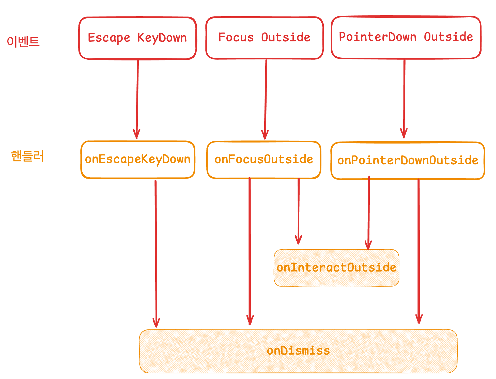
콜백에서 <strong>event.preventDefault()</strong>호출하면 <br/>onDismiss의 호출(=기본동작)이 막힘

---

[스토리 예시](http://localhost:9009/iframe.html?id=utilities-dismissablelayer--basic&viewMode=story)

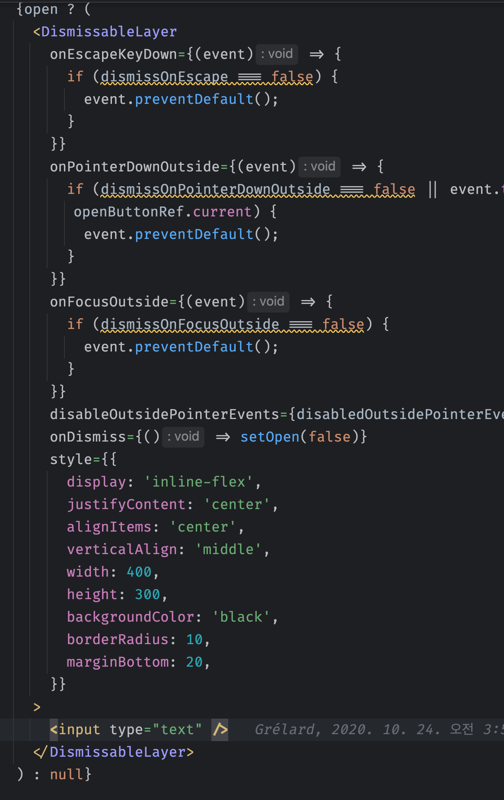 

---

*DismissableLayer*의 구현

---

살펴봐야 할 것
- `DismissableLayer`의 계층 구조
- 이벤트
    - EscapeKeydown
    - PointerDownOutside
    - FocusOutside

---

1. 계층구조

- 앱 내에 여러개의 `DismissableLayer`가 존재할 때
    - 각 레이어간의 관계는?
    - 어떤 레이어까지 인터랙션이 가능한지?
    - 내부적으로 어떻게 관리하는지?

---

Context
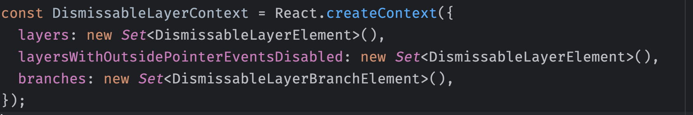

- 여러개의 DismissableLayer를 관리하기 위한 컨텍스트
    - Set으로 관리한다.
- Provider없이 사용하기 때문에, 사실상 전역 상태이다.


---

컨텍스트 값이 채워지는 예시

```tsx {data-line-numbers="3-5"}
(
    <>   
        <DismissableLayer1 
            disableOutsidePointerEvents={true}
        />
    </>
)
```
```ts
layers: { 1 }
layersWithOutsidePointerEventsDisabled: { 1 }
```

---

컨텍스트 값이 채워지는 예시

```tsx {data-line-numbers="6"}
(
    <>   
        <DismissableLayer1 
            disableOutsidePointerEvents={true} 
        />
        <DismissableLayer2 />
    </>
)
```
```ts
layers: { 1, 2 }
layersWithOutsidePointerEventsDisabled: { 1 }
```

---


컨텍스트 값이 채워지는 예시

```tsx {data-line-numbers="7"}
(
    <>   
        <DismissableLayer1 
            disableOutsidePointerEvents={true} 
        />
        <DismissableLayer2 />
        <DismissableLayer3 />
    </>
)
```
```ts
layers: { 1, 2, 3 }
layersWithOutsidePointerEventsDisabled: { 1 }
```

---


컨텍스트 값이 채워지는 예시

```tsx {data-line-numbers="3-5"}
(
    <>  
        <DismissableLayer4 
            disableOutsidePointerEvents={true} 
        />
        <DismissableLayer1 
            disableOutsidePointerEvents={true} 
        />
        <DismissableLayer2 />
        <DismissableLayer3 />
    </>
)
```

```ts
layers: { 1, 2, 3, 4 }
layersWithOutsidePointerEventsDisabled: { 1, 4 }
```

---

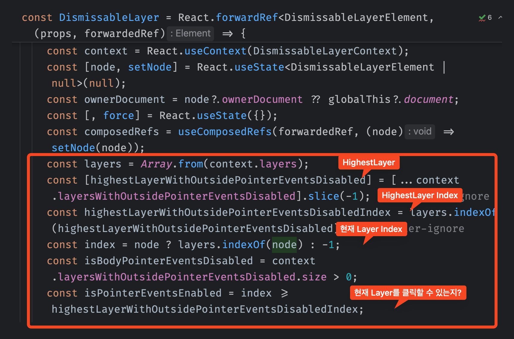


---

```tsx {data-line-numbers="3-5"}
(
    <>   
        <DismissableLayer1 
            disableOutsidePointerEvents={true}
        />
    </>
)
```
```ts
layers: { 1 }
layersWithOutsidePointerEventsDisabled: { 1 }
```

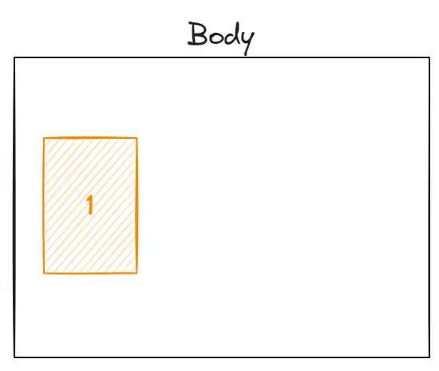

- Body안에서 1번 레이어 이외에는 클릭할 수 없음

---

```tsx {data-line-numbers="6"}
(
    <>   
        <DismissableLayer1 
            disableOutsidePointerEvents={true} 
        />
        <DismissableLayer2 />
    </>
)
```
```ts
layers: { 1, 2 }
layersWithOutsidePointerEventsDisabled: { 1 }
```

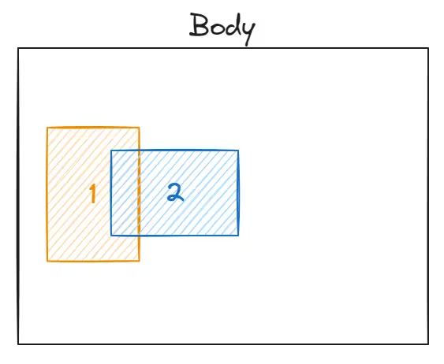


- 1번의 **disableOutsidePointerEvents**는 **true**이지만, 2번이 더 늦게 쌓였기 때문에, 2번은 클릭할 수 있음.
- 2번의 **disableOutsidePointerEvents**는 **false**이기 때문에, 1번도 클릭할 수 있음
- 나머지는 클릭할 수 없음

---

```tsx {data-line-numbers="7"}
(
    <>   
        <DismissableLayer1 
            disableOutsidePointerEvents={true} 
        />
        <DismissableLayer2 />
        <DismissableLayer3 />
    </>
)
```
```ts
layers: { 1, 2, 3 }
layersWithOutsidePointerEventsDisabled: { 1 }
```

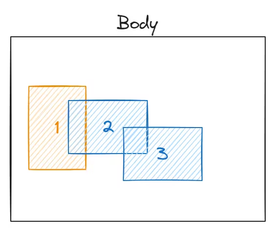


- 3번 클릭가능
- 3번의 disableOutsidePointerEvents prop이 false이기 때문에, 2번과 1번도 클릭 가능
- 나머지는 클릭할 수 없음

---

```tsx {data-line-numbers="3-5"}
(
    <>  
        <DismissableLayer4 
            disableOutsidePointerEvents={true} 
        />
        <DismissableLayer1 
            disableOutsidePointerEvents={true} 
        />
        <DismissableLayer2 />
        <DismissableLayer3 />
    </>
)
```

```ts
layers: { 1, 2, 3, 4 }
layersWithOutsidePointerEventsDisabled: { 1, 4 }
```

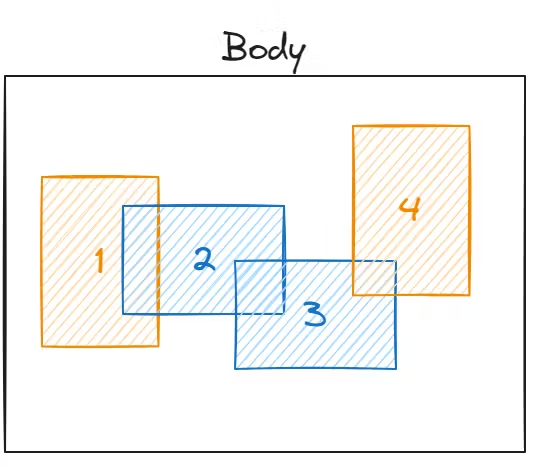

- 4번의 disableOutsidePointerEvents는 true이고, 4번이 가장 늦게 쌓였기 때문에, 4번보다 일찍 쌓인 1,2,3번은 클릭할 수 없음.

---

특정 레이어만 클릭 가능하게 만들기

<div style="position: absolute;" class="fragment fade-in-then-out">

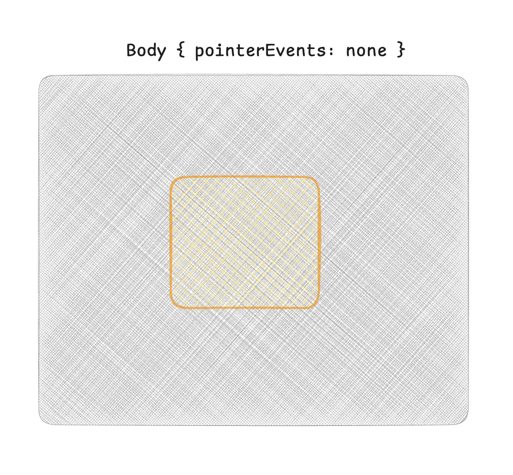

</div>


<div style="position: absolute;" class="fragment fade-in">


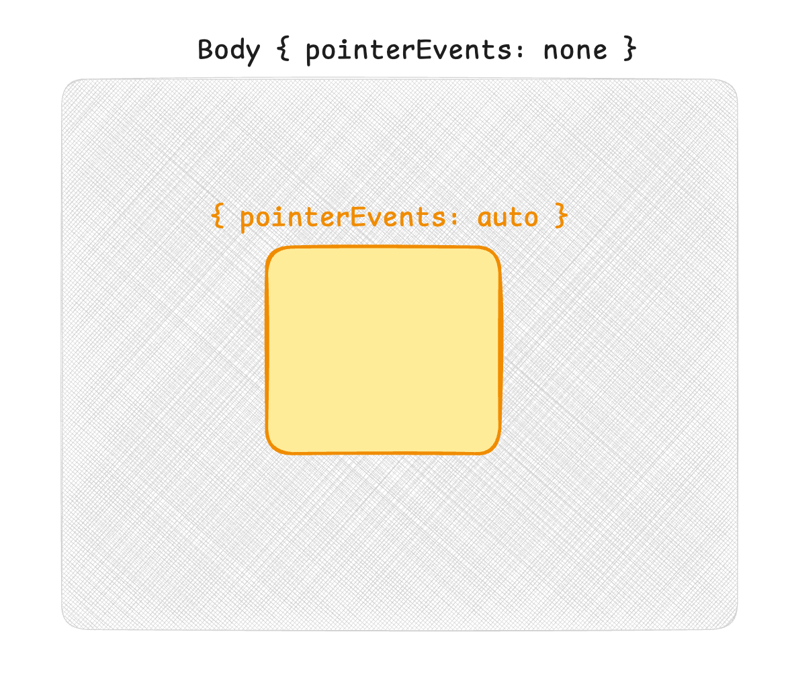

</div>


---

이벤트의 구현
- EscapeKeyDown -> useEscapeKeydown

- PointerDownOutside -> usePointerDownOutside

- FocusOutside -> useFocusOutside

---

useEscapeKeydown

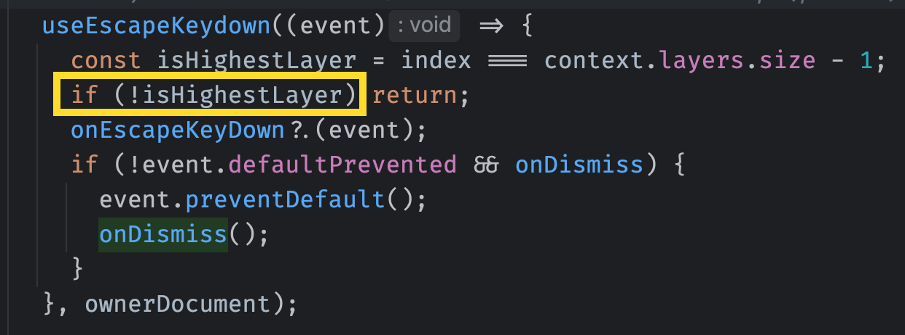

---

usePointerDownOutside

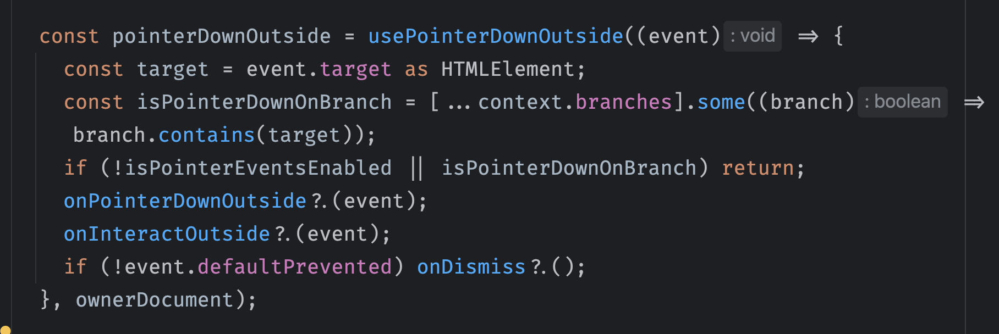

<div class="fragment fade-in-then-out">

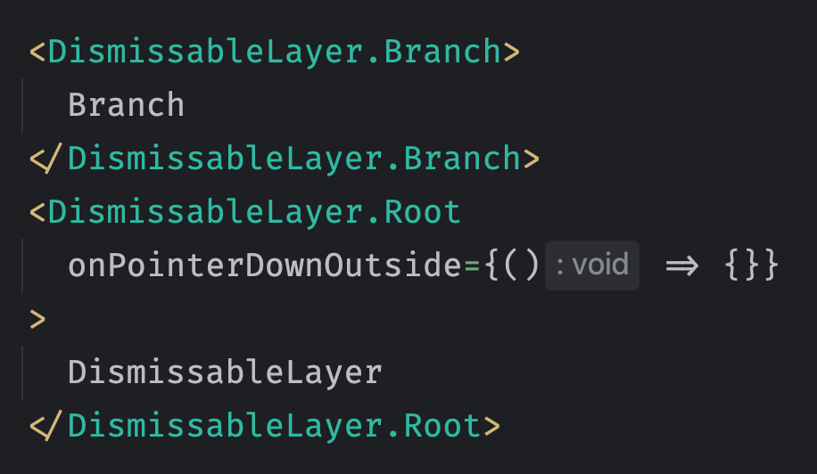

[예시](http://localhost:9009/iframe.html?id=utilities-dismissablelayer--basic&viewMode=story)

</div>

---

useFocusOutside

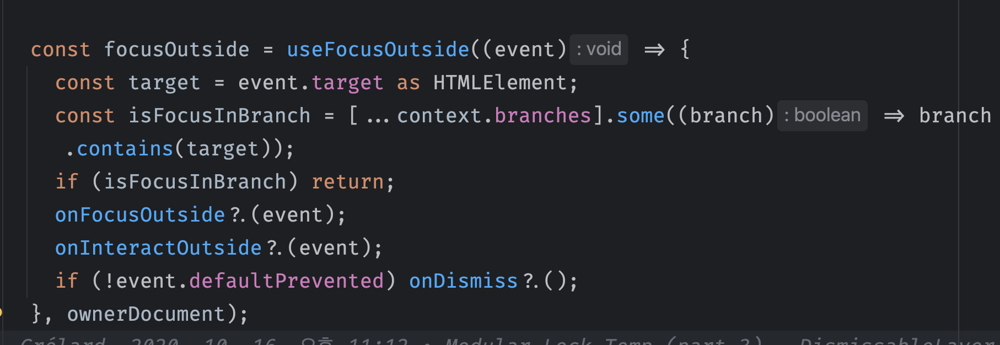

---

***FocusScope***

---

```tsx {data-line-numbers="2-7, 10"}
<>
    <FocusScope
        loop
        trapped
        onMountAutoFocus
        onUnmountAutoFocus
    >
        <Component />
        <Component />
    </FocusScope>
</>
```

---

[모달](http://localhost:9009/iframe.html?args=&id=components-dialog--focus-trap&viewMode=story)
```tsx
<>
    <FocusScope
        trapped={true}
        loop={true}
        asChild
    >
        <DismissableLayer
            disableOutsidePointerEvents={true}
        >
            {children}
        </DismissableLayer>
    </FocusScope>
</>
```
- 레이어 외부 클릭이 막혀있고
- 포커스가 갇혀있음

---

[논모달](http://localhost:9009/iframe.html?args=&id=components-dialog--non-modal&viewMode=story)

```tsx
<>
    <FocusScope
        trapped={false}
        loop={true}
        asChild
    >
        <DismissableLayer
            disableOutsidePointerEvents={false}
        >
            {children}
        </DismissableLayer>
    </FocusScope>
</>
```

- 레이어 외부 클릭이 허용되고
- 포커스는 갇히지 않음. (루프는 허용)

