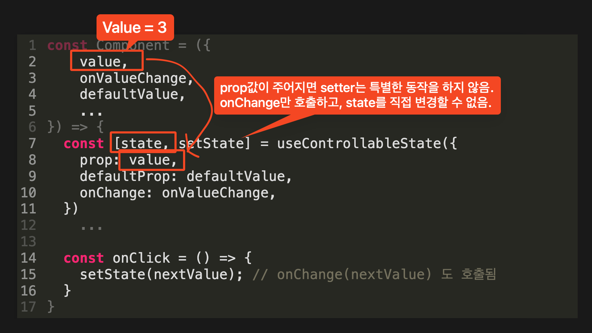
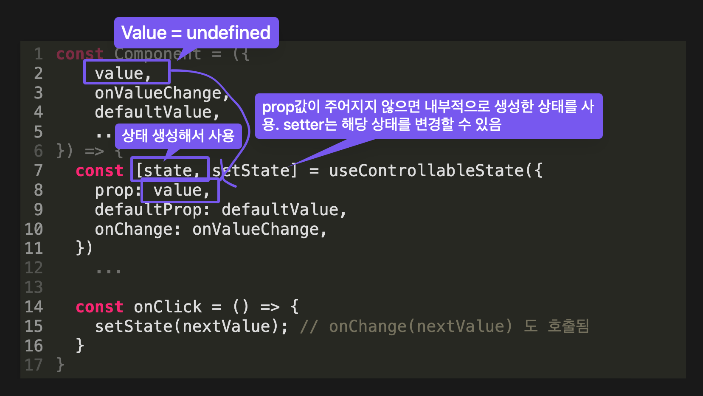

**_Controlled & Uncontrolled_**

제어 & 비제어

---

input

```tsx
<>
  <input />

  // `defaultValue`는 초깃값에만 영향을 줌
  <input defaultValue="123" />
</>
```

---

input

```tsx
const [value, setValue] = useState('');

<>
  <input
  	value={value}
    onChange={(e) => { setValue(e.target.value) }}
  />
</>
```

---

<ul class="font-small">
<li>Radix의 컴포넌트는 복잡한 내부 상태의 흐름을 Consumer가 제어하지 않아도 컴포넌트 기본 사용 방법에 따라 사용하면 알아서 상태 관리가 된다.</li>
</li>
 

> 내부 상태가 있는 모든 컴포넌트는 uncontrolled(=내부적으로 관리) 또는 controlled(=consumer가 관리)가 될 수 있다.
[radix-ui/philosophy.md](https://github.com/radix-ui/primitives/blob/main/philosophy.md)
 

</ul>

---

[예시: Radix Dialog (Uncontrolled)](http://localhost:9009/iframe.html?args=&id=components-dialog--uncontrolled-example&viewMode=story)

```tsx
<>
    <Dialog.Root>
        <Dialog.Trigger>
            트리거 버튼
        </Dialog.Trigger>

        <Dialog.Portal>
            <Dialog.Content>
                <div>Content</div>

                <Dialog.Close>
                    닫기 버튼
                </Dialog.Close>
            </Dialog.Content>
        </Dialog.Portal>
    </Dialog.Root>
</> 
``` 


---

[예시: Radix Dialog (Controlled)](http://localhost:9009/iframe.html?args=&id=components-dialog--controlled-example&viewMode=story)

```tsx {data-line-numbers=""}
<>
    <Dialog.Root 
        open={open}
        onOpenChange={(value) => setOpen(value)} 
    >
        <Dialog.Trigger>
            트리거 버튼
        </Dialog.Trigger>

        <Dialog.Portal>
            <Dialog.Content>
                <div>Content</div>

                <Dialog.Close>
                    닫기 버튼
                </Dialog.Close>
            </Dialog.Content>
        </Dialog.Portal>
    </Dialog.Root>
</>
```

<ul class="font-small">
<li>open은 열림/닫힘 상태를 나타낸다.</li>
<li>

controlled로 사용하더라도, **onOpenChange**는 Dialog 스펙대로 상태가 변화해야 하는 시점에, 변화해야 하는 상태값을 인자로 호출된다.

</li>

---

***useControllableState***

- controlled, uncontrolled를 지원하기 위해 사용하는 유틸리티

---

- useControllableState

<div class="fragment">

```tsx {data-line-numbers="2-5, 7-11, 14-16"}
const Component = ({ 
    value, 
    onValueChange, 
    defaultValue, 
    ... 
}) => {
	const [state, setState] = useControllableState({
		prop: value,
		defaultProp: defaultValue,
		onChange: onValueChange,
	})
    ...

	const onClick = () => {
		setState(nextValue); // onChange(nextValue) 도 호출됨
	}
}
```

</div>

<div class="fragment absolute fade-in-then-out">


</div>

<div class="fragment absolute ">


</div>

---


내부 구현

```tsx {data-line-numbers="8-10, 20, 22"}
const useControllableState = ({
	prop,
	defaultProp,
	onChange,
}) => { 
	...
	
	const isControlled = prop !== undefined;
	const value = isControlled ? prop : internalState;
	const setValue = (nextValue) => {
		if (isControlled) {
			const val = 
				typeof nextValue === 'function' 
					? nextValue(prop)
					: nextValue; 
			if (val !== prop) onChange(val);
		} else {
			setInternalState(nextValue);
		}
	}
	
	return [value, setValue];
}
```

---

<ul class="font-small">


- [체크박스 만들어보기](https://codesandbox.io/p/sandbox/radix-playground-v496mn?file=%2Fsrc%2FCheckbox.tsx%3A1%2C27)


- controlled, uncontrolled로 사용 가능
