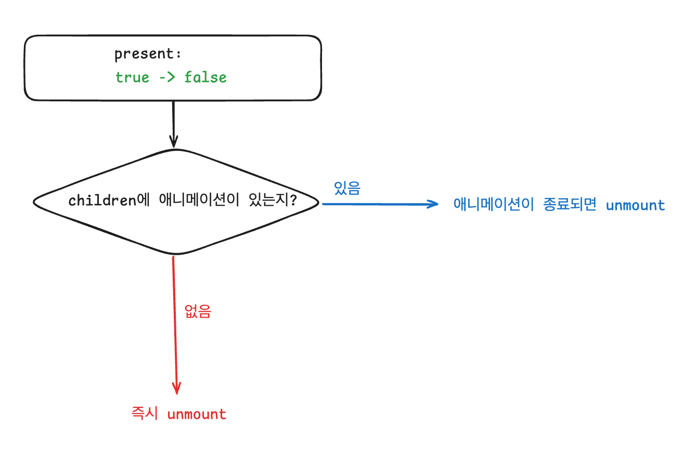
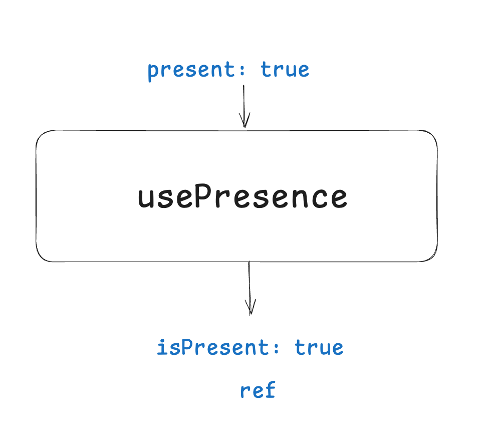
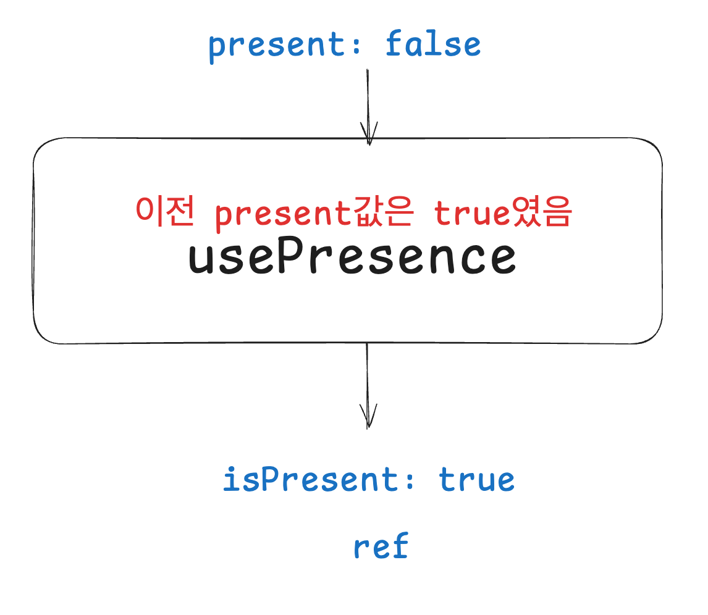
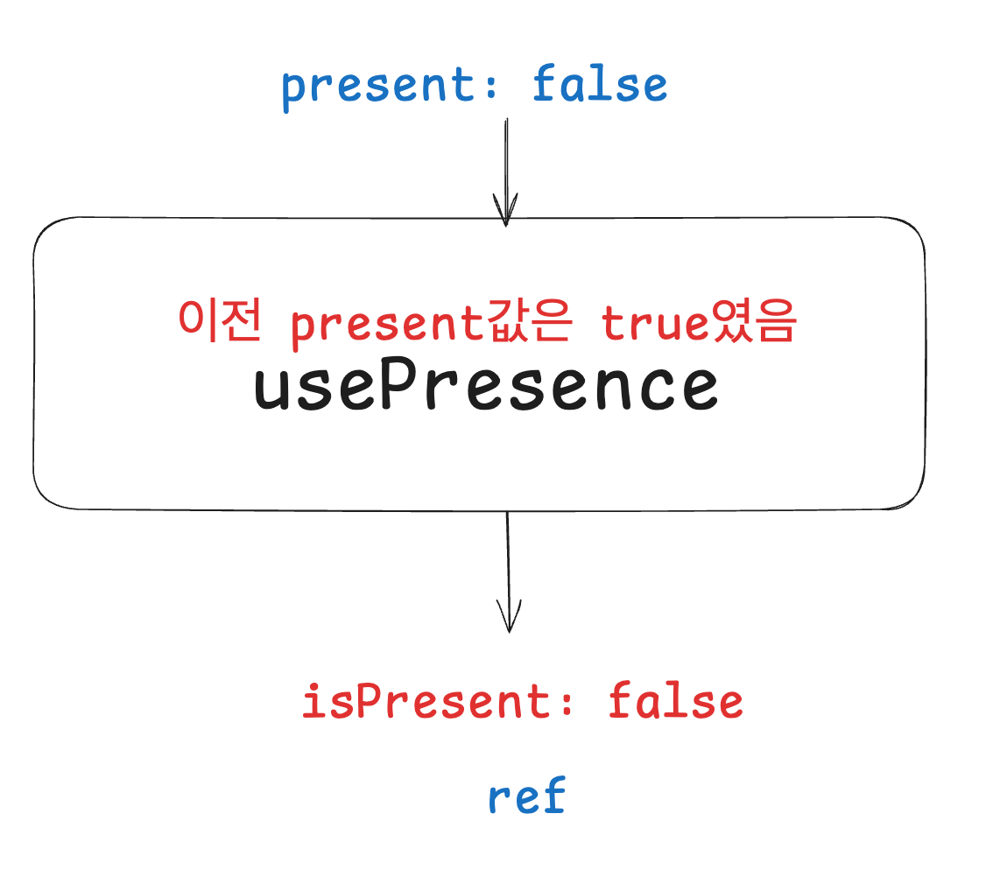
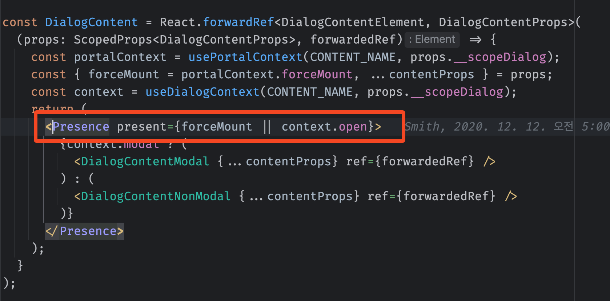
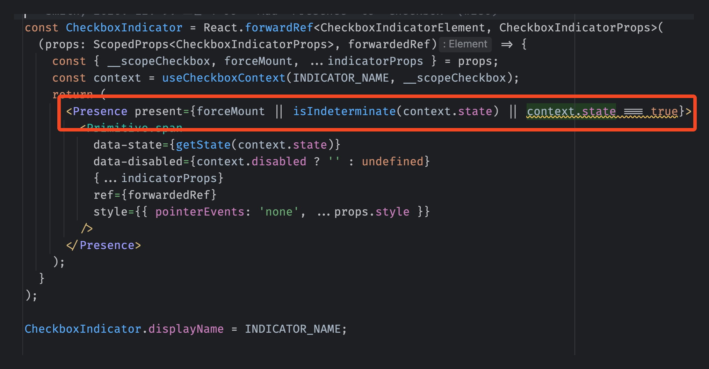
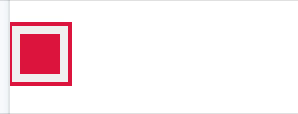
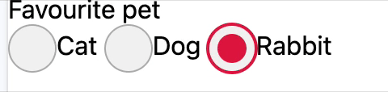
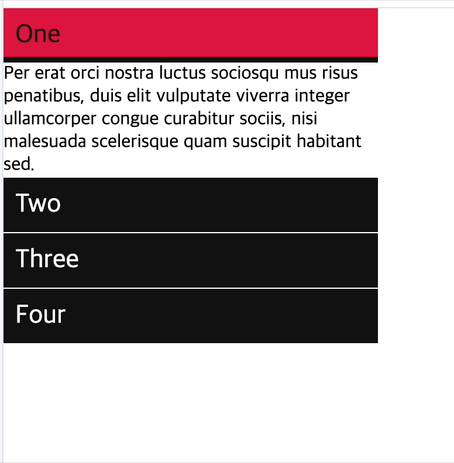

**_Presence_**

---

**_Presence_**

<ul class="font-mid">

- 조건부 렌더링
- unmount 시점에 애니메이션을 재생

</ul>

---

- [컴포넌트 마운트 시점에 애니메이션을 적용하기](https://codesandbox.io/p/sandbox/radix-playground-v496mn?file=%2Fsrc%2FMountAnimation.tsx%3A3%2C14)

```tsx
const Div = () => {
    return (
        <div className="div">
            Div
        </div>
    )
}

// css

.div {
    animation: fadeIn 1000ms;
}

@keyframes fadeIn {
    0% { opacity: 0 }
    100% { opacity: 1 }
}
```

---

unmount 시점에 애니메이션을 재생하려면 

1. unmount트리거시, 렌더링 상태를 일단 유지
2. 애니메이션을 재생함
3. 애니메이션이 종료되면 unmount함

<strong>`Presence`</strong>는 위 기능을 제공한다.

---

Presence의 기능

<div class="fragment font-small">1. children의 렌더링을 제어한다.</div>
<div class="fragment font-mid">

```tsx
<>
    <Presence present={true}>
        <Child />
    </Presence>

    // present 값이 children 엘리먼트의 렌더링 여부를 나타냄
    <Presence present={false}>
        <Child />
    </Presence>
</>
```

</div>

<div class="fragment">

<div class="font-small">내부적으로 다음과 같을 구조임을 예상할 수 있다.</div>


```tsx
const Presence = ({ present, ...props }) => {
    return (
        present ? props.children : null;
    )
}
```


</div>


---


Presence의 기능

<div class="font-small">

2. <strong>present</strong> prop의 값이 **true** → **false**로 바뀌는 경우에

</div>




---

- 동작 흐름

```tsx {data-line-numbers="2"}
<>
    <Presence present={true}>
        <Component />
    </Presence>
</>
```
<ul class="font-mid">

1. present값이 true이기 때문에, <strong>`Component`</strong>가 렌더링된다.

</ul>

---

- 동작 흐름

```tsx {data-line-numbers="2"}
<> 
    <Presence present={false}>
        <Component />
    </Presence>
</>
```

<ul class="font-mid">

2. present값이 **true**에서 **false**로 바뀌었다. 
    - Component에 animation이 적용되어있으면, 애니메이션 재생 후 unmount된다.
    - Component에 animation이 적용되어있지 않았으면, 즉시 unmount된다.

</ul>


---


unmount시점에 애니메이션 재생하는 방법

[간단 사용 예시](https://codesandbox.io/p/sandbox/radix-playground-v496mn?file=%2Fsrc%2FUnmountAnimation.tsx%3A5%2C14-5%2C30)


```tsx
<>
    <Presence present={open}>
        <div data-state={open ? "open" : "closed"}>
            DIV
        </div>
    </Presence>
</>

// css
div[data-state="closed"] {
    animation: fadeOut 1000ms;
}

```

---

내부 구현

1. children 렌더링 결정하는 상태
    - usePresence
2. 애니메이션을 감지하는 방법
3. 주의사항

---

children 렌더링 결정하는 상태

```tsx {data-line-numbers="3,5,7-9"}
const Presence = ({ present, children }) => {
    const { 
       isPresent, 
       ref,
    } = usePresence(present);

    return isPresent 
        ? React.cloneElement(children, { ref }) 
        : null;
}
```

---

usePresence
 


<ul class="font-small">

- isPresent는 children의 실제 렌더링 여부를 나타내는 값

</ul>

---

usePresence
 
!

---

usePresence
 


- 애니메이션이 종료된 후 isPresent값이 false가 된 상태.

---

애니메이션은 어떻게 감지?


```tsx {data-line-numbers="4, 8"}
const Presence = ({ present, children }) => {
    const { 
       isPresent, 
       ref,
    } = usePresence(present);

    return isPresent 
        ? React.cloneElement(children, { ref }) 
        : null;
}
```

- **children**에 **ref**를 강제로 붙이는 코드
- 이 **ref**를 통해, 내부적으로 **children** 엘리먼트를 참조할 수 있고, DOM API를 사용하여 애니메이션 적용 여부를 알아낼 수 있다.
- **animationend** 이벤트 발생시 **isPresent**를 **false**로 변경

---

주의사항

- **children**은 반드시 **ref**를 전달받을 수 있는 컴포넌트여야 한다. 안그러면 애니메이션 감지를 못하기 때문에 동작하지 않는다.
    - 리액트 18 에선 forwardRef를 사용해야 한다.
    - 리액트 19 대응도 되어있음

```tsx
const Component = forwardRef((props, ref) => {
    return (
        <div ref={ref}>...</div>
    )
})
```

---

<div class="font-small">
<strong>Presence</strong>는 Radix에서 제공하는 여러 컴포넌트에 사용된다.
</div>





---





</div>
