**_Slot_**

---

**_Slot_**

Slot으로 전달된 prop을 children의 prop과 합친다.

---

- 사용 방법

```tsx
<>
    <Slot onClick={(e) => console.log("slot")}>
        <div onClick={(e) => console.log("div")}>
            DIV
        </div>
    </Slot>
</>
```

<div class="fragment">

<div class="font-small">실제 DOM에 렌더링되는 모습은 다음과 같다.</div>

```html
<div>
    DIV
</div>
```

<div class="font-small">DIV 클릭시, 합성된 클릭 핸들러가 호출된다. 위 예시에선 <strong>"div"</strong> -> <strong>"slot"</strong>순으로 로깅된다.</div>

</div>

---

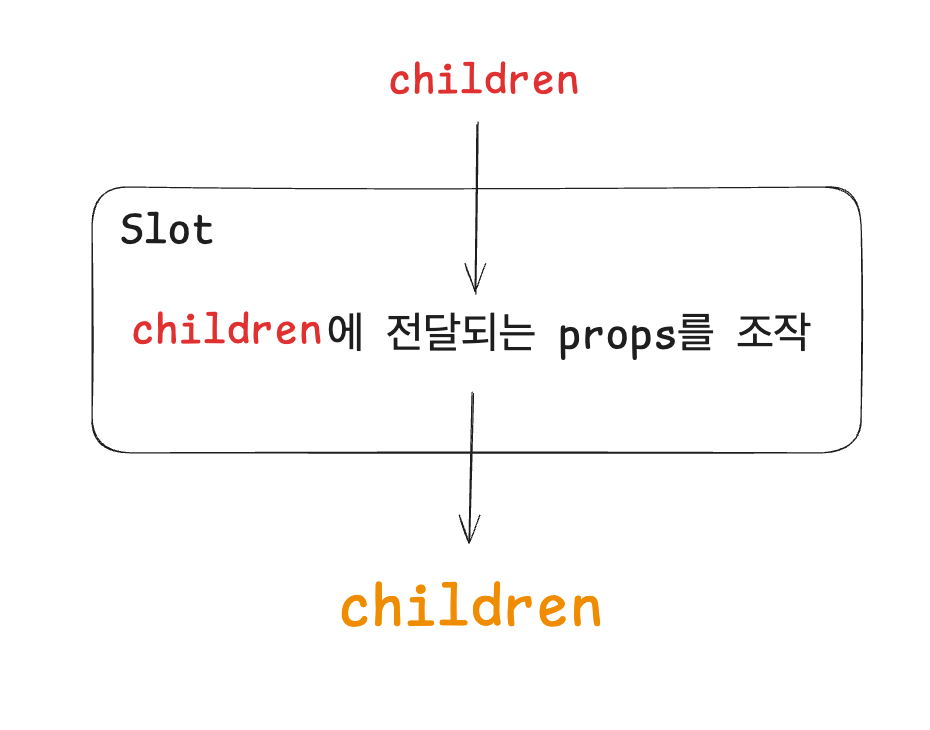

<div class="fragment">

```tsx
const Slot = forwardRef((props, slotRef) => {
  const { children, ...slotProps } = props;
  const childrenProps = children.props;
  const composedRefs = slotRef 
    ? composeRefs(slotRef, childrenProps.ref) 
    : childrenProps.ref;

  return React.cloneElement(children, {
    ...mergeProps(slotProps, childrenProps),
    ref: composedRefs,
  })
})
```

</div>

---

Slot이 합성하는 prop의 종류

1. <strong>^on[A-Z]</strong>정규식에 매칭되는 prop (= handler)

<div class="fragment">

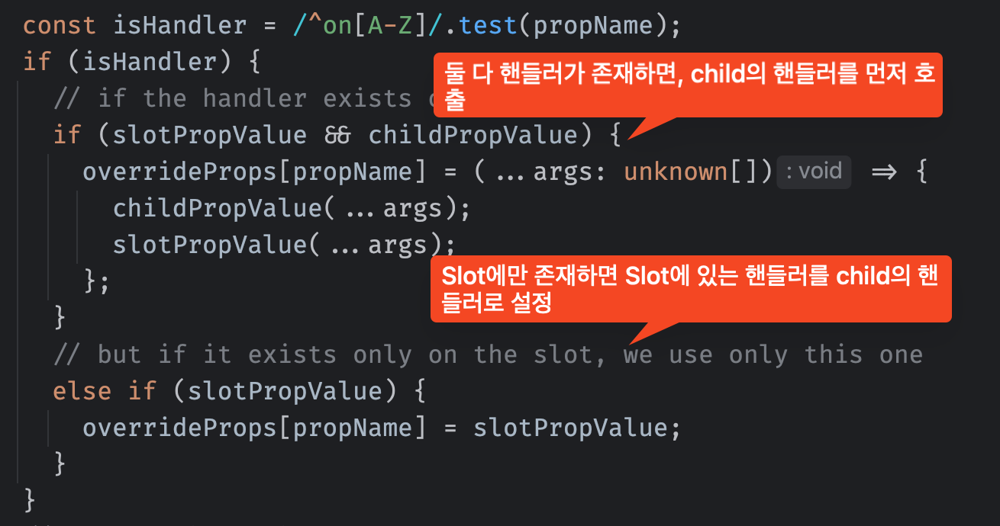

</div>

---

Slot이 합성하는 prop의 종류

2. <strong>className</strong>

<div class="fragment">

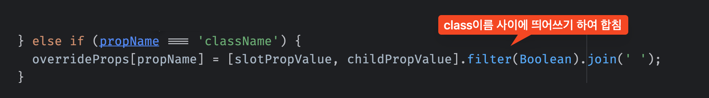

</div>

---

Slot이 합성하는 prop의 종류

3. <strong>style</strong>

<div class="fragment">

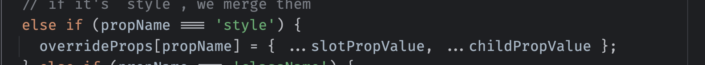

</div>

---

Slot이 합성하는 prop의 종류

4. <strong>ref</strong>

<div class="fragment fade-in-then-out absolute" >

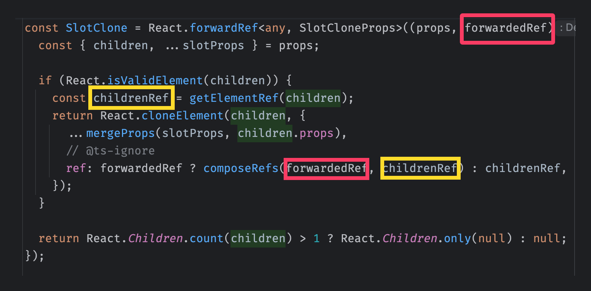

</div>

---

그 외의 props는 오버라이드

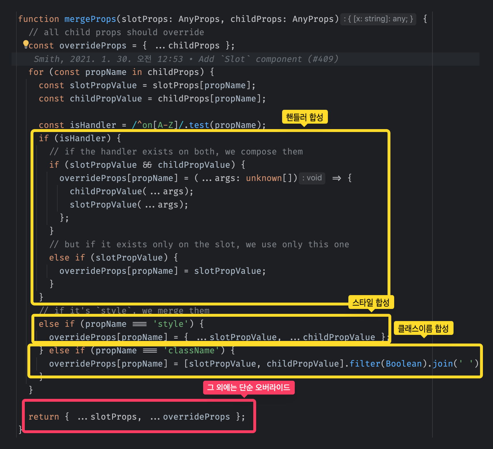


---


Slot 활용

- **asChild 패턴**

  - 컴포넌트를 다형적으로 사용할 수 있게

  - 엘리먼트 타입을 변경할 수 있는 prop을 제공

<div class="fragment">

```tsx
const Button = ({ asChild, ...props }) => {
    const Comp = asChild ? Slot : 'button';

    return (
        <Comp {...props} className="button" />
    )
}
```

</div>

<div class="fragment">

```tsx
const App = () => {
    return (
        <>
            <Button>버튼</Button>

            <Button asChild>
                <a href="...">
                    링크 버튼
                </a>
            </Button>
        </>
    )
}
```

</div>

---

- Radix의 컴포넌트들은 기본 태그와 <strong>asChild</strong>패턴을 결합한 컴포넌트로 구현되기 때문에, 대부분 <strong>asChild</strong> 패턴을 지원한다.

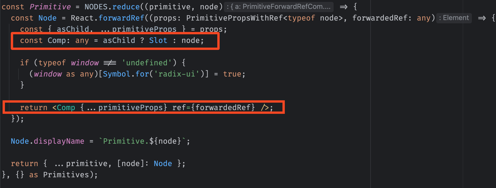

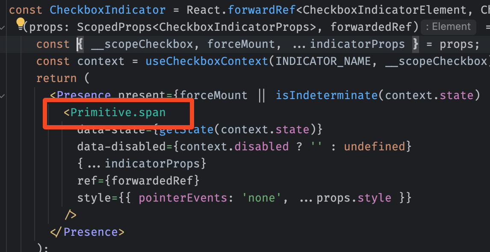

---

__주의사항__

children은 한개만 가능

<div class="fragment fade-in-then-out absolute">

```tsx
// 정상 동작
<>
  <Slot>
    <Child />
  </Slot>
</>
```

</div>

<div class="fragment fade-in-then-out absolute">

```tsx
// 오류 발생함
<>
  <Slot>
    <Child />
    <Child />
    <Child />
  </Slot>
</>
```

</div>

---

__Slottable__

<div class="fragment absolute fade-in-then-out">

```tsx {data-line-numbers="6,7, 9,10"}
<>
    <Slot>

        <div>Prefix</div>

        <Slottable>
            <a>
                <A_Children />
            </a>
        </Slottable>

        <div>Suffix</div>

    </Slot>
</>
```

</div>


<div class="fragment absolute fade-in-then-out">

```tsx {data-line-numbers="2, 6, 10, 14"}
<>
    <a>

        <div>Prefix</div>

        <Slottable>

                <A_Children />

        </Slottable>

        <div>Suffix</div>

    </a>
</>
```

</div> 


<div class="fragment absolute fade-in-then-out">


```tsx {data-line-numbers=""}
<>
    <a>

        <div>Prefix</div>


        <A_Children />


        <div>Suffix</div>

    </a>
</>
```


</div>

---

Slot 활용: __Collection__

컬렉션 아이템들을 추적하기 위한 컴포넌트

<ul style="display: flex; flex-direction: column;">

<li class="fragment">
Tabs


<div class="fragment fade-in-then-out absolute">

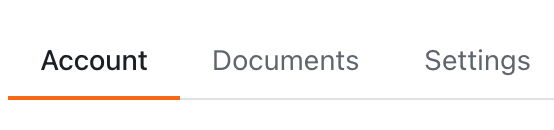

</div>

<div class="fragment fade-in-then-out absolute">

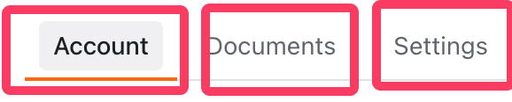

</div>


</li>

<li class="fragment">
Toasts


<div class="fragment fade-in-then-out absolute">

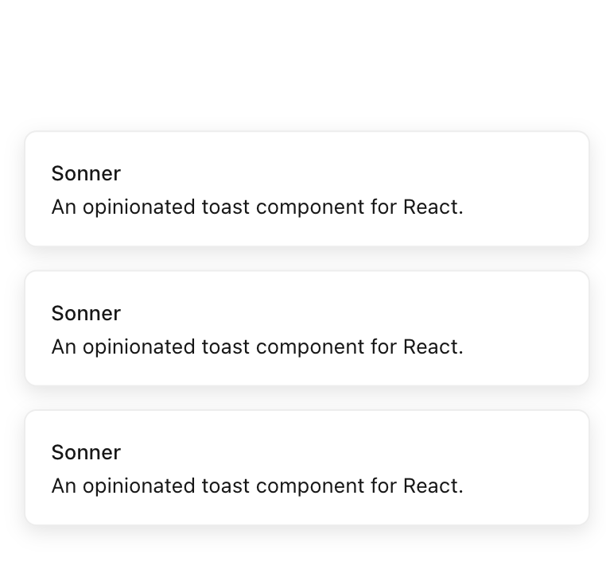

</div>

<div class="fragment fade-in-then-out absolute">

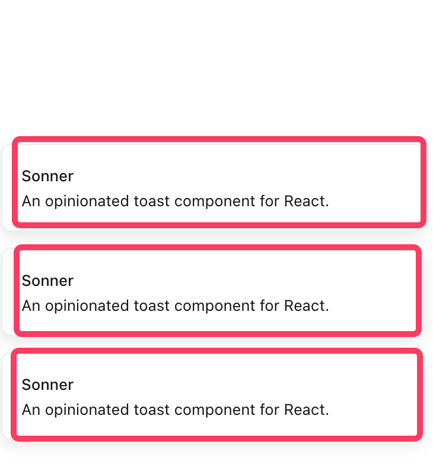

</div>


</li>


<li class="fragment">
Slider Thumbs

<div class="fragment fade-in-then-out absolute">

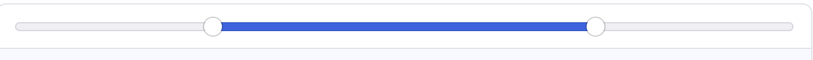

</div>

<div class="fragment fade-in-then-out absolute">

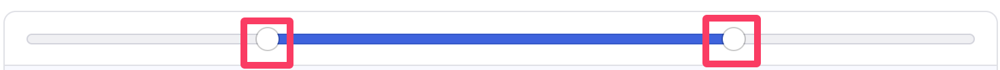

</div>

</li>

</ul>

---

Slot 활용: __Collection__

- 컬렉션 아이템 하나에서 컬렉션 전체에 접근할 수 있다.

---

Slot 활용: __Collection__

<div class="fragment fade-in-then-out absolute">

```tsx
const ButtonItem = (props: {
    children: ReactNode; 
    disabled: boolean; 
    value: string;    
}) => {
    return (
        <button type="button" {...props}>
            {chlidren}
        </button>
    )
}
```

</div>

<div class="fragment fade-in-then-out absolute">

```tsx
const ButtonItem = (props: {
    children: ReactNode; 
    disabled: boolean; 
    value: string;    
}) => {
    return (
        <Collection.ItemSlot {...props}>
            <button type="button">
                {chlidren}
            </button>
        </Collection.ItemSlot>
    )
}
```

</div>

---

Slot 활용: __Collection__

```tsx {data-line-numbers="2,3,5-8,10,12,13, 16-22"}
<>
  <Collection.Provider>
    <Collection.Slot>
      <ul>
        <ButtonItem disabled={true} value="1">..</ButtonItem>
        <ButtonItem disabled={false} value="2">..</ButtonItem>
        <ButtonItem disabled={false} value="3">..</ButtonItem>
        <ButtonItem disabled={false} value="4">..</ButtonItem>
      </ul>
    </Collection.Slot>

    <LogItems />
  </Collection.Provider>
</>

const LogItems = () => {
    const getItems = useCollection()

    useEffect(() => {
        console.log(getItems());
    });
}
```

<div class="fragment fade-in-then-out absolute">

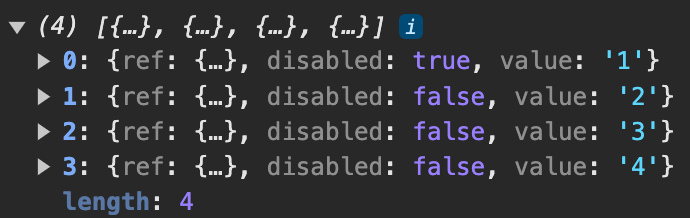


</div>

<div class="fragment fade-in-then-out absolute">

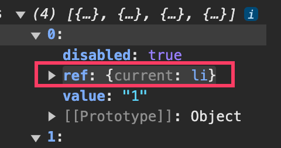

</div>


---

[Navigation Menu 스토리](http://localhost:9009/iframe.html?args=&id=components-navigationmenu--submenus&viewMode=story)

  
<div class="fragment fade-in-then-out absolute">

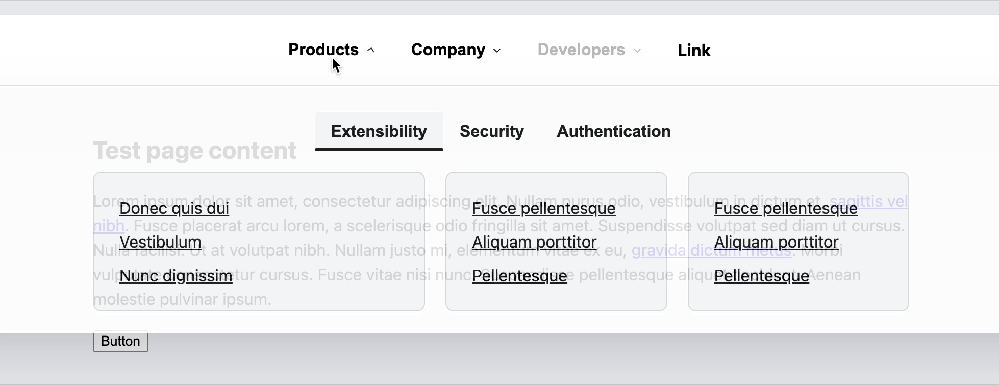

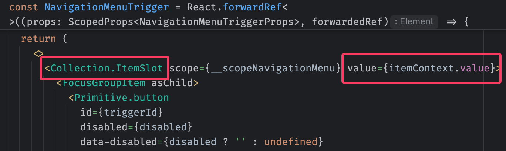

</div>
 

<div class="fragment fade-in-then-out absolute">

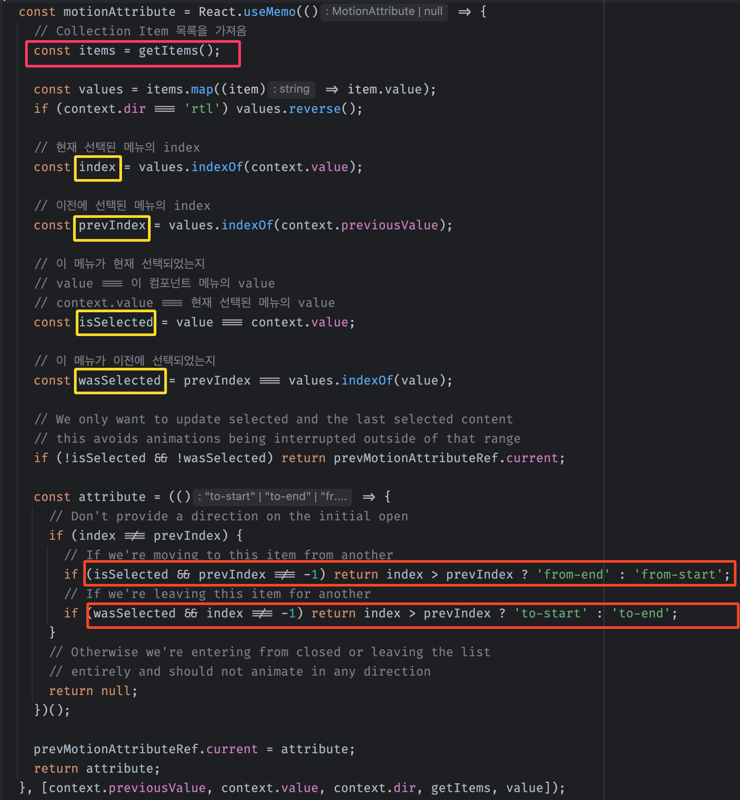

</div>

<div class="fragment fade-in absolute">

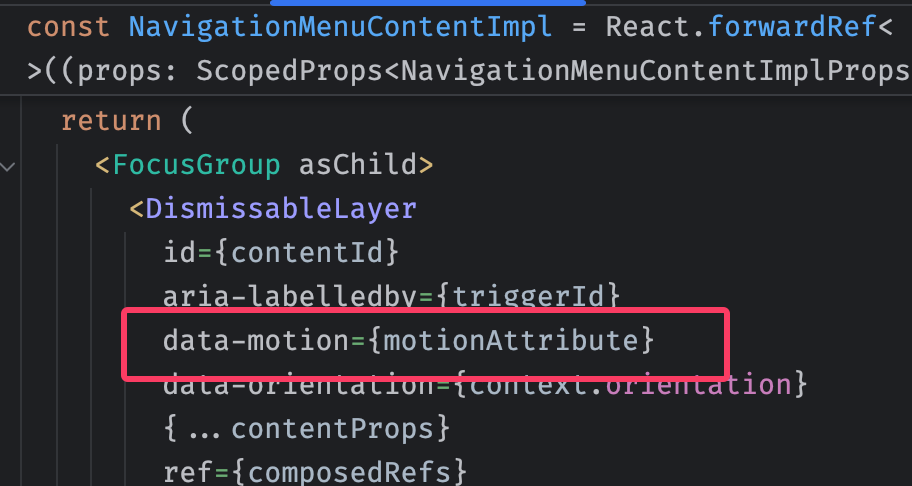

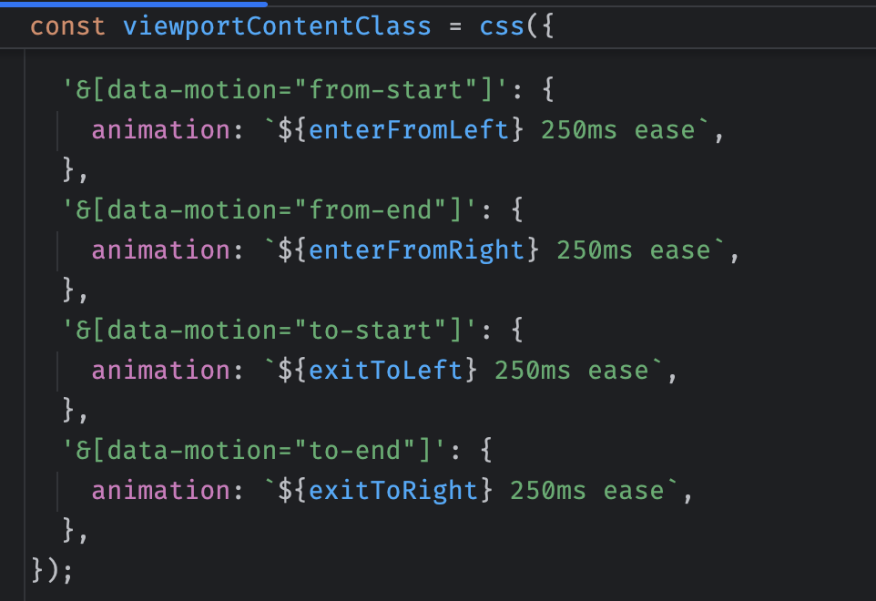

</div>
